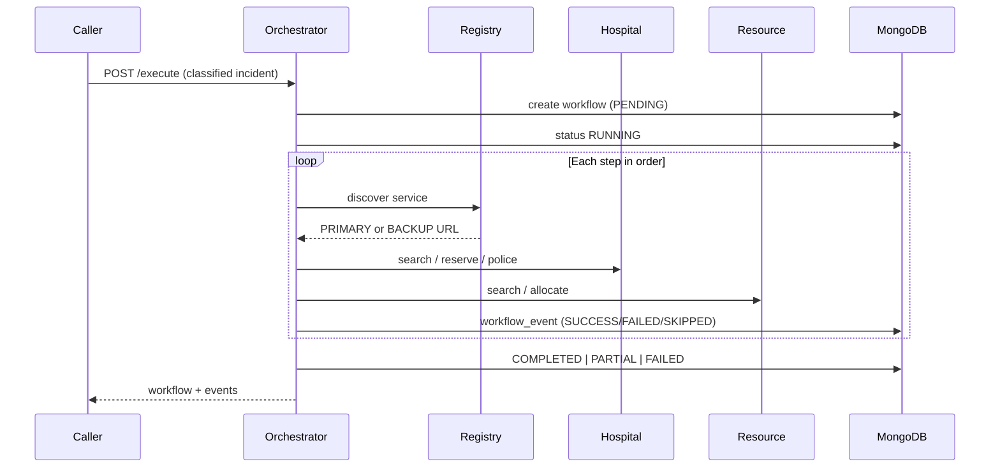

# Architecture Overview — Phase 13 (Final)

## System Design

ResilientResponse is a microservices-based emergency coordination platform built as a Final Year Project. It covers the full emergency-response lifecycle: alert ingestion from GDACS/CAP/Demo sources, rule-based disaster classification, sequential workflow orchestration with PRIMARY/BACKUP service failover, route calculation, notification dispatch, and a live monitoring admin UI. Phase 13 completes the final audit, configuration cleanup, and documentation pass.

---

## Architecture Diagram

```
External Sources
  GDACS RSS ──────────┐
  CAP XML ────────────┤
  DEMO ───────────────┤
                      ↓
              alert-service :8002
              (adapter + dedup + store)
                      │
                      ↓ alert payload (manual or automated trigger)
              classification-service :8003
              (stateless rule-based engine)
                      │
                      ↓ ClassificationResult + incident_id
              orchestrator :8001
              (8-step sequential workflow engine)
                      │
          ┌───────────┼────────────┬──────────────┐
          ↓           ↓            ↓              ↓
  hospital-service  resource-service  route-service  notification-service
  :8004 (PRIMARY)   :8005 (PRIMARY)   :8006          :8007
  :8014 (BACKUP)    :8015 (BACKUP)
          │           │
          └───────────┘
                      │ all service calls go through discovery
                      ↓
              service-registry :8008
              (registration + health checks + PRIMARY/BACKUP discovery)
                      │
                      ↑ proxied through
              api-gateway :8000
              (JWT auth + reverse proxy + /api/monitoring/summary)
                      │
                      ↑
              Next.js Frontend :3000
              (desktop admin dashboard, 11 pages)
```

**Data flow rule:** The frontend only ever calls the API Gateway (`:8000`). The API Gateway proxies every `/api/*` request to the appropriate backend service. The orchestrator uses the Service Registry for dynamic discovery and PRIMARY→BACKUP failover on every downstream call.

---

## Service Layer and Dashboard Integration

| Service | Port | Role in the Admin Console |
|---|---|---|
| frontend | 3000 | Desktop admin dashboard with multi-page operational views |
| api-gateway | 8000 | Single authenticated API surface for all admin UI calls |
| orchestrator | 8001 | Workflow execution history and orchestration status |
| alert-service | 8002 | Alert ingestion and incident creation records |
| classification-service | 8003 | Rule-based classification results behind workflow triggers |
| hospital-service | 8004 | Hospitals and police stations CRUD + operational data |
| resource-service | 8005 | Emergency resources inventory and allocation |
| route-service | 8006 | Route records and travel calculations |
| notification-service | 8007 | Outbound delivery log and recipient status |
| service-registry | 8008 | Health checks and instance discovery |

---

## Classification Service

### API

```
POST /api/classification/classify   — Classify an alert
GET  /health                        — Health check (returns version 0.5.0)
```

### Input (ClassificationRequest)

All fields optional — provide as many as available:

| Field | Source | Example |
|---|---|---|
| alert_id | Internal ID for tracing | "abc-123" |
| event_type | GDACS code | "EQ", "TC", "FL", "VO", "WF", "TS", "LS" |
| headline | Alert title | "Flash flood warning" |
| description | Full description | "Coastal inundation expected" |
| severity | Source severity | "HIGH", "Red", "Severe" |
| urgency | CAP urgency | "Immediate", "Expected" |
| certainty | CAP certainty | "Observed", "Likely" |
| affected_area | Geographic area | "Coastal zone" |
| source | Alert source | "GDACS", "CAP", "DEMO" |

### Output (ClassificationResult)

```json
{
  "alert_id":      "abc-123",
  "disaster_type": "EARTHQUAKE",
  "severity":      "HIGH",
  "confidence":    0.95,
  "matched_rules": ["event_type_code:EQ", "source_severity:high"],
  "reason":        "Classified as EARTHQUAKE with HIGH severity (confidence 95%). ..."
}
```

### Supported disaster types

`FLOOD | CYCLONE | EARTHQUAKE | LANDSLIDE | CHEMICAL | FIRE | TSUNAMI | VOLCANO | DROUGHT | STORM | UNKNOWN`

### Supported severity values

`LOW | MEDIUM | HIGH | CRITICAL`

---

## Classification Rules

### Disaster type rules (`app/rules/disaster_rules.py`)

Three rule layers evaluated in combination:

**1. Structured event type code** (highest priority, confidence 0.95)
```
EQ → EARTHQUAKE    TC → CYCLONE    FL → FLOOD
VO → VOLCANO       DR → DROUGHT    WF → FIRE
TS → TSUNAMI       LS → LANDSLIDE  CH → CHEMICAL
```

**2. Keyword scan** (confidence 0.65–0.85, scans headline + description + affected_area)
```
flood, flash flood, inundation         → FLOOD
cyclone, hurricane, typhoon            → CYCLONE
earthquake, seismic, tremor, magnitude → EARTHQUAKE
landslide, mudslide, debris flow       → LANDSLIDE
chemical, hazmat, toxic, radiation     → CHEMICAL
fire, wildfire, forest fire            → FIRE
tsunami, tidal wave                    → TSUNAMI
volcano, eruption, lava                → VOLCANO
drought, water scarcity                → DROUGHT
storm, tornado, thunderstorm           → STORM
```

**3. GDACS code in text** (weaker, 0.85 × code confidence)

Multiple matches accumulate per type; the type with the highest total score wins.

### Severity rules (`app/rules/severity_rules.py`)

**Step 1 — Source severity mapping** (case-insensitive)
```
critical / Red / Extreme  → CRITICAL
high / Orange / Severe    → HIGH
medium / Green / Moderate → MEDIUM
low / Minor               → LOW
```

**Step 2 — CAP urgency/certainty adjustment**
- Immediate + Observed → bump severity up
- Future + Unlikely    → bump severity down

**Step 3 — Text keyword override**
- "life-threatening", "mass casualty" → bump up
- "advisory only", "minor damage"     → bump down

---

## Design Properties

- **Deterministic** — same input always produces same output
- **Transparent** — every decision is explained via `matched_rules` + `reason`
- **Extensible** — add rules in `app/rules/` without touching router or engine
- **No external dependencies** — no LLM, no AI API, no network calls to classify
- **Independent service** — registers with Service Registry on startup

---

## Orchestrator — Workflow Engine (Phase 7)

### Trigger API

```
POST /api/workflows/execute
GET  /api/workflows
GET  /api/workflows/{id}
GET  /api/workflows/{id}/events
```

### Execution flow



### Supported disaster workflows

FLOOD, CYCLONE, EARTHQUAKE, LANDSLIDE, CHEMICAL, FIRE

Each workflow runs (in order):

1. Record classification snapshot
2. Search hospitals (geo + beds)
3. Reserve beds (**critical**)
4. Search police
5. Search resources by type
6. Allocate resources (**critical**)
7. Plan route — **route-service** `POST /api/routes/calculate` (non-critical)
8. Dispatch notification — notify hospital/police via notification-service (non-critical)

### Status rules

| Status | Meaning |
|---|---|
| PENDING | Created, not yet running |
| RUNNING | Steps executing |
| COMPLETED | All steps succeeded (including deferred skips) |
| PARTIAL | Non-critical step failed; workflow continued |
| FAILED | Critical step failed; workflow stopped |

### Resilience

- Every downstream call uses `discover_ordered_instances()` — PRIMARY first, then BACKUP
- HTTP 5xx / connection errors retry on the next healthy instance
- Duplicate service addresses are ignored to prevent duplicate failover attempts
- Individual service failures do not crash the orchestrator process
- Critical failure → FAILED + `failure_reason`; non-critical → PARTIAL
- Phase 11 validates failover, recovery, provider-failure handling, and bounded retry behavior via automated tests

### Persistence (`workflows`, `workflow_events`)

Workflow document: `incident_id`, `workflow_type`, `status`, `current_step`, `total_steps`, `classification_snapshot`, `failure_reason`, timestamps.

Event document: `workflow_id`, `step_index`, `service`, `action`, `status`, `error`, `duration_ms`, `result`, `timestamp`.

---

## Route Service (Phase 8)

### APIs

```
POST /api/routes/calculate   origin/destination coordinates → distance, ETA, geometry
GET  /api/routes/{id}          persisted route record
GET  /health
```

### Provider

- Default: OSRM (`ROUTING_PROVIDER_URL`, e.g. `https://router.project-osrm.org`)
- On provider failure: persist route with `PROVIDER_UNAVAILABLE`, return HTTP 503 — **no fabricated geometry**
- Registers with Service Registry on startup; own `routes` MongoDB collection only

### Orchestrator integration

`plan_route` uses incident coordinates as origin and reserved hospital (or resource) as destination. Failure marks workflow **PARTIAL** (non-critical step); orchestrator process continues.

---

## Hospital Service (Phase 6)

### APIs

```
GET  /api/hospitals/search          lat, lon, radius_km, city, min_beds, active_only
POST /api/hospitals/{id}/reserve    {"beds": N}
POST /api/hospitals/{id}/release    {"beds": N}
GET  /api/police-stations/search    lat, lon, radius_km, city, active_only
GET  /api/police/search             alias for police-stations search
```

### Design
- Haversine distance filter applied in service layer (no external geo DB)
- `reserve_beds` uses MongoDB atomic `$inc` with `available_beds >= beds` guard — capacity never goes negative
- `release_beds` capped at `emergency_capacity`
- Police and hospitals share the hospital-service process but use separate MongoDB collections

---

## Resource Service (Phase 6)

### APIs

```
GET  /api/resources/search          type, lat, lon, radius_km, city, available_only, min_quantity
POST /api/resources/{id}/allocate   {"quantity": N}
POST /api/resources/{id}/release    {"quantity": N}
```

### Design
- Filters by type, city, availability; geo radius applied after DB query
- `allocate_resource` atomic decrement with status guard (INACTIVE/MAINTENANCE rejected)
- Status auto-set to DEPLOYED when `available_quantity` reaches 0
- `release_resource` capped at total `quantity`

---

## Test Coverage

| Suite | Tests | Phase 12 additions |
|---|---|---|
| classification-service | 70 | — |
| alert-service | 31 | — |
| service-registry | 27 | 7 (enhanced /summary per-service breakdown) |
| hospital-service | 66 | — |
| resource-service | 57 | — |
| orchestrator | 45 | 8 (workflow summary + engine logging) |
| route-service | 8 | — |
| api-gateway | 15 | 8 (/api/monitoring/summary aggregation) |
| notification-service | 40 | 6 (/summary endpoint + send logging) |
| **Total** | **359** | **+30 Phase 12** |

---

## Phase 12 — Monitoring + Observability

### Structured Logging

All 9 services now emit structured operational log lines. No secrets or sensitive payloads are ever logged. Log format: `%(asctime)s %(levelname)s %(name)s: %(message)s`.

**Covered events:**

| Event | Service | Log namespace |
|---|---|---|
| Service startup / registry registration | All | `<service-name>` |
| Health-state changes (UP/DEGRADED/DOWN/RECOVERING) | service-registry | `registry.monitor` |
| Service discovery (PRIMARY/BACKUP selection) | orchestrator | `orchestrator.discovery` |
| PRIMARY → BACKUP failover | orchestrator | `orchestrator.client` |
| Retry attempts / failover exhausted | orchestrator | `orchestrator.client` |
| Workflow start / completion | orchestrator | `orchestrator.engine` |
| Workflow step start / success / failure | orchestrator | `orchestrator.engine` |
| Workflow PARTIAL / FAILED | orchestrator | `orchestrator.engine` |
| Hospital bed reservation success / failure | hospital-service | `router.hospitals` |
| Resource allocation success / failure | resource-service | `router.resources` |
| Route provider success / failure | route-service | `router.routes` |
| Classification result | classification-service | `router.classification` |
| Notification delivery SENT / FAILED | notification-service | `notification.send_service` |

### Enhanced Registry Summary

`GET /api/registry/summary` now returns a `services` list alongside the existing totals:

```json
{
  "total_instances": 8,
  "healthy_instances": 7,
  "status_counts": { "UP": 6, "DEGRADED": 1, "DOWN": 1 },
  "services": [
    {
      "service_name": "hospital-service",
      "total_instances": 2,
      "healthy_instances": 2,
      "status_breakdown": { "UP": 2 },
      "instances": [
        {
          "instance_id": "hospital-primary",
          "role": "PRIMARY",
          "status": "UP",
          "last_health_check": "<iso-datetime>",
          "response_time_ms": 42,
          "error": null,
          "base_url": "http://hospital-primary:8004",
          "version": "0.6.0"
        }
      ]
    }
  ]
}
```

### Monitoring Aggregation Endpoint

`GET /api/monitoring/summary` (API Gateway, JWT required) fetches three backends in parallel using `asyncio.gather`:

| Source | Backend call |
|---|---|
| `registry` | `GET /api/registry/summary` on service-registry:8008 |
| `workflows` | `GET /api/workflows/summary` on orchestrator:8001 |
| `notifications` | `GET /api/notifications/summary` on notification-service:8007 |

Each section carries `"available": true/false`. The endpoint always returns HTTP 200 — partial backend failure degrades gracefully.

### Admin UI Monitoring Pages

**Dashboard** — Three monitoring cards added above the existing activity panels:
- Service Health: healthy/total count with per-status breakdown; colour-coded (green 100%, yellow partial, red <50%)
- Workflows: total executions with running/completed/partial/failed split
- Notifications: total dispatched with sent/failed/pending split
- Auto-refreshes every 15 s

**Services** — New "Service Health Overview" grid (from `GET /api/registry/summary`):
- One card per logical service showing PRIMARY/BACKUP instances
- Status dot + role badge + response time per instance
- Inline error message when last health check returned an error
- `HealthBar` component visualises healthy fraction

**Workflows** — Rewritten page:
- Summary bar: total/running/completed/partial/failed counts
- Status filter tabs (All / Running / Completed / Partial / Failed) with per-tab counts
- Duration column; progress bar colour-coded by final status
- "Step events" detail modal: per-step icon (✓/✗), service, action, duration_ms, error, timestamp
- `PARTIAL` status now has amber colour in `StatusBadge`

**Notifications** — Rewritten page:
- Summary bar: total/sent/failed/pending
- Status filter tabs + recipient type filter tabs
- New columns: Workflow ID, Provider
- Inline `failure_reason` in table
- Detail modal: message text, provider, full timestamps, failure reason

### Architecture invariants preserved

- Frontend → API Gateway → backend services (no direct service access)
- No Kafka, no WebSockets, no AI/ML introduced
- No new roles or dashboards added (single ADMIN role, desktop-only)
- Polling/refresh via `setInterval` (15 s) — no push infrastructure

---

## Phase 13 — Final Polish + Release Readiness

### Issues Resolved

| # | Category | Fix |
|---|---|---|
| 1 | Config | `orchestrator/.env.example`: `SERVICE_VERSION` corrected to `0.7.0`; `HOSPITAL_SERVICE_URL` corrected to `http://hospital-primary:8004` |
| 2 | Config | `hospital-service/.env.example` and `resource-service/.env.example`: `SERVICE_VERSION` corrected to `0.6.0` |
| 3 | Config | `docker-compose.yml`: `hospital-primary/backup` and `resource-primary/backup` version strings updated to `0.6.0`; `route-service` dependency on `mongo` added; healthcheck blocks added to `hospital-backup` and `resource-backup` |
| 4 | Config | `api-gateway/app/config.py`: stale "Phase 3" comment removed |
| 5 | UI | `settings/page.tsx`: phase label updated to Phase 12; Python version corrected to 3.13 |
| 6 | UI | `Sidebar.tsx`: footer version updated from `v0.3.0` to `v1.0.0` |
| 7 | UI | `incidents/page.tsx` and `routes/page.tsx`: Refresh button added for UX consistency |
| 8 | Docs | README: Services table descriptions updated; workflow curl example corrected to use API Gateway (port 8000); Environment Variables section added; Phase 13 entry added to roadmap |
| 9 | Docs | `architecture.md`: diagram expanded to show all 9 services; Phase 13 entry added to roadmap |

### Security Audit Notes

These are intentional choices for a local development / FYP context, documented explicitly:

- `JWT_SECRET` has a fallback default — the Settings page shows a visible `⚠` warning to change it before deployment
- Admin credentials are in `.env.example` and loaded by docker-compose — documented with a note in the Quick Start
- MongoDB has no authentication — acceptable for local dev only; the compose file documents this
- No `.env` files committed to source control; only `.env.example` templates

### Architecture Invariants (all phases)

- Frontend → API Gateway → backend services only; no direct service access from browser
- Single `ADMIN` role; desktop-only multi-page Next.js app
- No Kafka, no AI/ML, no IoT, no mobile UI added at any phase
- All service-to-service calls in the orchestrator use Service Registry discovery (PRIMARY → BACKUP fallback)
- Structured logs never contain passwords, JWTs, secrets, or sensitive payloads

---

## Phase Roadmap

| Phase | Status | Description |
|---|---|---|
| 1 | ✅ Complete | Foundation — stubs, Docker |
| 2 | ✅ Complete | Database layer, auth, CRUD, dashboard |
| 3 | ✅ Complete | Service Registry, discovery, health monitoring, multi-instance |
| 4 | ✅ Complete | Alert integration — GDACS, CAP, Demo, deduplication |
| 5 | ✅ Complete | Rule-based classification service |
| 6 | ✅ Complete | Operational hospital/police/resource services |
| 7 | ✅ Complete | Workflow engine + orchestrator |
| 8 | ✅ Complete | Route service + workflow integration |
| 9 | ✅ Complete | Notification service + delivery log |
| 10 | ✅ Complete | Admin dashboard integration |
| 11 | ✅ Complete | Resilience + failover validation |
| 12 | ✅ Complete | Monitoring + Observability |
| 13 | ✅ Complete | Final Polish + Release Readiness |
